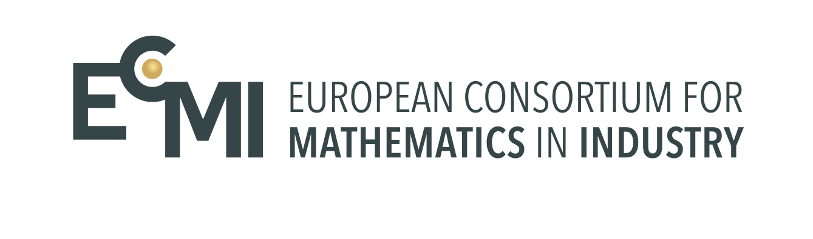

First Virtual ECMI Modeling Week 2017\
LUT, Finland

This project will provide a reader with some hands-on experience in ecological modelling. 
Ecological modelling is about analyzing and building mathematical models of ecological processes. 
Such models help to understand complex ecological processes (e.g. the spread of viruses, tracking the fragile species, curbing the decline of
endangered species) and predict how real ecosystems might change in the future. In this project we will study both continuous and discrete models. 

In particular, we are interested in population modeling, which is concerned about the changes in state variables, such as population size and age
distribution within a population. The change might be caused by interactions with the environment and/or with the
individuals of their own species or other species. We will observe this kind of interactions in our models as well.

I should also note that we will build what’s called Individual-based models (agent-based models). 
Individual-based approach is a concept of population ecology that rests on the premise that population properties should be derived from properties of individuals, 
the interactions among autonomous individuals with each other and their environment. 

Please follow the MATLAB script from here on. Thank you! 
